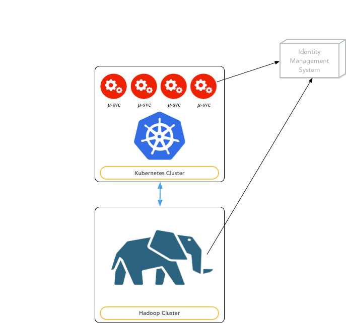

# Deployment View

The DAF platform is designed to be deployed on two disjoint clusters of machines, as shown in the next figure:

1. *Kubernetes Cluster* - this cluster is composed by nodes with the role of edge nodes from the Hadoop cluster standpoint. The edge nodes are configured to have access to all the Hadoop platforms as client.
Moreover, these nodes are hosting a kubernetes cluster where all the 𝜇-services will be deployed. Being deployed on nodes that are also Hadoop edge nodes provides the 𝜇-services with the capabilities to interact with Hadoop out of the box.

2. *Hadoop Cluster* - this is the cluster of machines where Hadoop has been deployed.

   

From a deployment perspective, other essential points regard the integration with:

* an Identity Management System, in order to centralize the user account management and to enable the implementation of all security issues;

* tools supporting the access, the manipulation and the analysis of datasets.

## IMS integration

An important piece is the integration with an external Identity Management System ([currently a FreeIpa instance](https://www.freeipa.org)). All the information regarding users and user groups willing to access the platform are centrally listed on this system. This is the base for implementing all the authentication and authorization mechanisms the DAF platform will require for securing the data access.

Any user that will access the platform shall be registered in the Identity Management System and any access to the data will be tracked allowing the auditing of data accesses for security purposes.

As shown in the following figure, both the Kubernetes Cluster and the Hadoop Cluster refer to the same IMS. Consequently, it is possible to map user accounts created on the two cluster, improving the security of the entire system.  

## Notebook support

The platform will support the usage of notebooks for accessing and manipulating the data. The platform will provide access to the Hadoop computational resources through proper services that avoid the user to access the Hadoop cluster directly.

A possible approach could be the combination of a REST service like [livy](http://livy.io) with a tool like [Sparkmagic](https://github.com/jupyter-incubator/sparkmagic) for giving access from a Jupyter notebook to Spark.

The platform will provide special libraries for directly accessing the data sets from the notebooks just by knowing their URIs.
