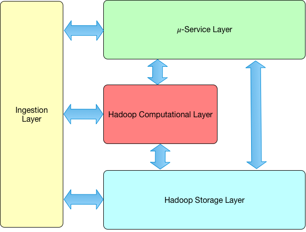

# Piano di sviluppo DAF

Il [Data & Analytics Framework](https://pianotriennale-ict.readthedocs.io/it/latest/doc/09_data-analytics-framework.html) (DAF) è una delle attività atte a valorizzare il patrimonio informativo pubblico nazionale approvata dal Governo italiano nell’ambito del [Piano Triennale per l’Informatica nella PA 2017-2019](https://pianotriennale-ict.italia.it).

Il DAF è composto da:

Una **Piattaforma Big Data** composta da:

- un *data lake*, un insieme di data engine e strumenti per la comunicazione dei dati. 
Nel data lake vengono memorizzati, nel rispetto delle normative in materia di protezione dei dati personali, dati di potenziale interesse quali, ad esempio: le basi di dati che le PA generano per svolgere il proprio mandato istituzionale; i dati generati dai sistemi informatici delle Pubbliche amministrazioni come log e dati di utilizzo che non rientrano nella definizione precedente; i dati autorizzati provenienti dal web e dai social network di potenziale interesse della Pubblica amministrazione.

- I *Big Data Engine* sono utili ad armonizzare ed elaborare, sia in modalità batch che real-time, i dati grezzi memorizzati nel data lake e a implementare modelli di machine learning.
Infine gli strumenti per la comunicazione dei dati sono utili a favorire la fruizione dei dati elaborati da parte dei soggetti interessati, anche attraverso API che espongono dati e funzionalità ad applicazioni terze.

- Da un team composto da data scientist, big data architect ed esperti di dominio che provvedono al disegno e all’evoluzione concettuale della Piattaforma big data, alla costruzione di modelli di interconnessione delle diverse sorgenti dati, all’analisi dei dati, allo sviluppo di modelli di machine learning, al coordinamento dello sviluppo di data application e all’incentivazione della ricerca scientifica su tematiche di interesse per la PA.

L’obiettivo principale del DAF è di sviluppare e semplificare l’interoperabilità dei dati pubblici tra PA e promuoverne l’utilizzo a supporto del *decision making* pubblico, standardizzare e promuovere la diffusione degli open data, ottimizzare i processi di analisi dati e generazione di sapere. 
L’idea è quella di aprire il mondo della PA ai benefici offerti dalle moderne piattaforme per la gestione e l’analisi dei big data agendo lungo quattro direttrici principali:

- amplificare il valore del patrimonio informativo della PA mediante l’utilizzo delle tecnologie big data che consentono di creare conoscenza e ridurre drasticamente i tempi di analisi;
- favorire e ottimizzare lo scambio dei dati tra PA, minimizzandone i costi transattivi per l’accesso e l’utilizzo;
- incentivare la diffusione degli open data e renderne più efficace l’utilizzo;
- favorire l’analisi esplorativa dei dati da parte di team di data scientist, sia in seno alle singole PA che a livello centrale, per migliorare la conoscenza dei fenomeni sociali.

Il DAF consentirà la promozione di iniziative di ricerca scientifica su tematiche di interesse specifico per la PA, favorendo la collaborazione con Università ed enti di ricerca.

I principali utenti del DAF sono le **Pubbliche amministrazioni**, che a seconda dei casi possono utilizzare il DAF per:

- accedere in lettura ai dati presenti nel DAF ed effettuare analisi a supporto del decision making (eccezion fatta per i dati sensibili il cui accesso deve essere autorizzato dagli owner del dato);
- sviluppare nuovi servizi non critici rivolti ai cittadini e alle imprese;
- sviluppare data application utili per migliorare i servizi erogati e i propri processi interni.

Alle PA si aggiungono le seguenti categorie di utenti: 
 
- *Data journalist*, che sono alla ricerca di informazioni analitiche per supportare le proprie tesi giornalistiche;

- cittadini che ricercano informazioni desumibili dagli strumenti di visualizzazione e dalle data stories pubblicate dal team di datascientist e dalla comunità sulla base dei dati e strumenti di analisi collegati al DAF;

- gli utilizzatori di opendata, ovvero la community degli sviluppatori e delle aziende che fanno uso degli opendata per creare applicazioni e servizi a valore aggiunto;

- il mondo della ricerca e dell’innovazione. Grazie al DAF sarà infatti possibile promuovere iniziative atte a coinvolgere il mondo della ricerca e dell’innovazione su tematiche di interesse pubblico.

Il DAF mette a disposizione di ciascuna PA:

- un insieme di **tool per l’analisi e l’elaborazione dei dati** presenti nel DAF che sfruttano le capacità di gestione ed elaborazione di big data, tra cui:
 - Un tool per generare dashboard e report.
 - Un notebook per effettuare analisi sui dati presenti nel DAF a cui l’utente ha accesso.

- L’accesso a un insieme di **dati utili per l’elaborazione di analytics**. Un elenco non esaustivo dei dati presenti nel DAF è:

 - **Dati delle basi di dati d’interesse nazionale**: le basi di dati d’interesse nazionale rappresentano building blocks dei sistemi informativi delle PA. I dati presenti su tali basi di dati sono autoritativi rispetto alle “entità” che gestiscono (ad es. ANPR è autoritativa per l’”entità” residente), Nel DAF è possibile trovare una copia sempre aggiornata dei dati in esse contenute: i dati che non hanno criticità dal punto di vista della privacy e della sicurezza sono accessibili a tutte le PA.

 - **Dati provenienti da altre PA**: le PA sono tenute (cfr. Piano triennale) a memorizzare nel DAF una copia dei dati utili a svolgere il proprio mandato istituzionale nonché i dati generati dai propri sistemi informatici (es. log) anche se non direttamente correlabili ai propri mandati istituzionali. Tali dati sono accessibili da parte di tutte le PA, salvo fatto per quei dati sui cui vigono norme in materia di protezione dei dati personali.
 
	- **Open data standard**: il DAF promuove la creazione di standard per la diffusione di open-data su temi di diffuso interesse pubblico (es. Mobilità, trasporti, turismo, eventi, ecc.). Grazie a tali standard un dataset può essere popolato in modo collaborativo da più PA.

	- **Dati di interesse pubblico di terze parti**: il DAF raccoglie e mette a disposizione di tutte le PA dati di terze parti di potenziale interesse pubblico (es. dati provenienti dai social networks, dati forniti da aziende, ecc.).

- **un servizio di pubblicazione di open-data di qualità**: poiché il DAF ospita copie aggiornate dei dati presenti nelle basi di dati delle PA, ciascuna PA può decidere di  abilitare un servizio per la pubblicazione dei propri open-data direttamente tramite apposite API esposte dal DAF. 

- **un insieme di data application** che implementano casi d’uso di interesse per interi cluster di PA (es. Servizio per la verifica della qualità delle informazioni contenuti nelle basi di dati della PA, previsionali per i comuni, sentiment analysis per l’intera PA, ecc.)
 
- **servizi di notifica best-effort di eventi real-time** (*egestion*) su flussi, eventualmente arricchiti e/o normalizzati, di dati veicolati verso il DAF e potenzialmente utili per la realizzazione di servizi non critici.   

Oltre a quanto messo a disposizione dalla piattaforma, attraverso il team di data scientist, il DAF offre un **supporto alle PA** per la costruzione di modelli di interconnessione delle diverse sorgenti dati, l’analisi dei dati, lo sviluppo di modelli di machine learning, il coordinamento dello sviluppo di data application e l’organizzazione di “competizioni” scientifiche su tematiche di interesse per la PA .

## Roadmap di evoluzione

Lo sviluppo del DAF prevede due fasi principali:

 - *Fase 1*: Realizzazione e sperimentazione
 - *Fase 2*: Messa in produzione
 
La prima fase, le cui attività sono concentrate nel secondo semestre 2017, è finalizzata alla realizzazione della piattaforma tecnologica e alla sua sperimentazione sulla base di casi d’uso individuati in collaborazione con alcune PA selezionate.
Sarà inoltre avviata una collaborazione con il Garante della Privacy per definire le modalità attraverso le quali le PA potranno formalizzare il rapporto con l’ente al quale, terminata la fase di sperimentazione, sarà affidata la gestione del DAF. In tal senso saranno anche stabilite le regole che, nel rispetto delle norme sulla privacy, definiranno le modalità di caricamento e di analisi dei dati sul DAF, nonché della diffusione dei dati e dei risultati delle analisi stesse.
 
Nella fase successiva, che andrà a regime dopo che sarà ufficializzato l’ente a cui sarà affidata l’operatività e l’evoluzione del DAF e avviati gli opportuni interventi normativi, il Team digitale ed AgID predisporranno le procedure atte a rendere operativo quanto prodotto durante la fase sperimentale.

Di seguito una roadmap di alto livello, redatta in base alle informazioni e disponibilità delle PA con cui si è attualmente in contatto, e che potrà essere soggetta a cambiamenti e integrazioni in base ai futuri sviluppi.

[inserire GANTT]

## Casi d'uso della fase sperimentale

A seguire un elenco di casi d'uso che  durante la prima : 

- [Implementazione e fruizione dataset chiave](casi-uso/dataset-chiave.md)
- [Pubblicazione Open Data “certificati” in SaaS (*Certified ODaaS*)](casi-uso/dataset-opendata-certificati.md)
- [Strumenti di Analisi & Dashboard Self Service](casi-uso/strumenti-analisi-dashboard.md)
- [Verifica della qualità delle informazioni delle base di dati](casi-uso/verifica-qualita-info.md)
- [Strumenti di monitoraggio automatico](casi-uso/strumenti-monitoraggio-automatico.md)
- [Servizi di notifica di eventi di interesse pubblico](casi-uso/valorizzazione-patrimonio-informativo-pubblico.md)
- [Data applications](casi-uso/data-applications.md)
- [Attività per la valorizzazione del patrimonio informativo pubblico](casi-uso/valorizzazione-patrimonio-informativo-pubblico.md)

## Modello di governance

Durante la fase sperimentale la governance del DAF è in carico al Team Digitale che ha il compito di gestire attivamente la fase di sviluppo concettuale e implementativo dell’infrastruttura, insieme a tutte le fasi del ciclo di vita del dato, dall’ingestione all’analisi e sviluppo di applicazioni. Il Team Digitale si farà anche carico di ingaggiare i rapporti con le PA coinvolte nella fase di sperimentazione e lavorerà insieme a loro per lo sviluppo di casi d’uso indicati nella roadmap.

Parallelamente il Team Digitale, in collaborazione con AgID e Garante della privacy, individua un ente che possa prendere in carico la gestione operativa del DAF e definisce un modello di governance nel quale sono ben definite le modalità attraverso quest’ultimo dovrà formalizzare il rapporto con le altre PA. 

Parallelamente, il Team Digitale, in stretta collaborazione con le istituzioni competenti, lavorerà per l’individuazione di una PA che prenderà in carico il progetto. Il Team Digitale e la PA selezionata lavoreranno in sinergia durante la fase di messa in produzione del DAF, durante la quale si effettueranno i passaggi di consegna e training.

## Architettura di alto livello

L’architettura logica del DAF è basata sui seguenti layers:

- *𝜇-Service Layer*: composto da tutti i servizi necessari per implementare le funzionalità della piattaforma. Tutte le componenti sono implementate come microservizi.

- *Ingestion Layer*: dedicato alla realizzazione di tutte le attività utili al caricamento dei dati.

- *Hadoop Computational Layer*: contiene tutte le piattaforme computazionali che tipicamente fanno parte dell’ecosistema Hadoop, tra cui si evidenzia [Spark](http://spark.apache.org/) sul quale si basano la maggior parte delle elaborazioni eseguite nel DAF. I microservizi presenti nel 𝜇-service layer utilizzano il livello computazionale per eseguire task utili all’accesso ai dati e alle operazioni di manipolazione e trasformazione. L’ingestion layer usa il  computational layer per eseguire operazioni di conversione e trasformazione dei dati.

- *Hadoop Storage Layer*: ovvero la piattaforma di memorizzazione dei dati fornita da [Hadoop](http://hadoop.apache.org). Benché tutti i dati del DAF siano memorizzati su HDFS (il filesystem distribuito del sistema Hadoop), a seconda delle esigenze è possibile che i dati siano replicati su [Kudu](https://kudu.apache.org) e [HBase](http://hbase.apache.org) per favorire l’efficienza computazionale dei tool di analisi.

L’immagine seguente riassume la vista logica dell’architettura del DAF: 

Dal punto di vista dell’architettura utile a ospitare il DAF, la piattaforma DAF è progettata per essere installata su due cluster disgiunti di macchine, così come mostrato nella figura successiva:

In dettaglio:

- *Kubernetes Cluster* - ovvero un cluster Kubernetes composto da nodi che svolgono il ruolo di edge per il cluster Hadoop: tali nodi ospitano i microservizi che fanno, in modalità client, uso delle risorse computazionali e di memorizzazione offerte dal cluster Hadoop. 

- *Hadoop Cluster* - ovvero un cluster di macchine su cui è installata una distribuzione Hadoop out-of-the-box in modalità multi-node.

