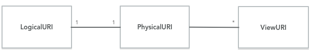

# DAF Architecture

## Introduction
The DAF (Data Analytics Framework) is a platform meant to gather and store data coming from different Italian public administrations. It should provide efficient and easy to use ingestion mechanisms for allowing external organisations to simply ingest their data into the platform with minimal human intervention.
The DAF platform shouldn’t only provide support for data at rest and fast data (streaming), but also for storing and managing collections of unstructured data, textual documents.
Besides providing those storing capabilities the next main goal is to provide a powerful mechanism for data integration, i.e. a way for integrating data that traditionally reside on separate siloes. Enabling the correlation of data sets normally residing on different systems/organisations can become a very powerful enabling factor for discovering new insights on the data.
The platform should allow the data scientists to access its computational power for implementing advanced analytics algorithms.
## Logical View
The DAF platform is ultimately an implementation of the “[data lake](https://en.wikipedia.org/wiki/Data_lake)” concept. Assembling a data lake involves a sequence of unavoidable steps meant to gather, organise and publish the data in an efficient and secure way.

The most important aspect to take into account in a data lake being set up is the data governance. Data governance means data organizations and metadata management. Being able to catalog the data sets together with their metadata is the prerequisite for implementing any further steps in the data lake set up such as data ingestion/egestion and data security.

The main abstraction the DAF platform is based upon is the data set. A data set means a collections of records described by some kind of schema. A data set is identified by a logical URI which identifies it in the data catalog and is associated to a physical URI that identifies the actual medium and location where the data is actually stored.

A LogicalURI must be associated to one and only one PhysicalURI that can be associated to zero or more ViewURIs. Let’s explain this with an example.
Let’s define a LogicalURI, for example, daf://open/milan/mobilita, this can be bound to the following PhysicalURI: dataset:hdfs://open/milan/mobilita and eventually to a ViewURI like: dataset:hive://mobilita/milan. That PhysicalUri represents the actual location on the Hadoop storage behind.

A ViewURI, then, it’s used to represents the fact that a dataset can be also exposed/view through a different platform.  As an example, a Hive/Impala external table created on top of a directory on HDFS represents a view of the same data stored in HDFS. This approach should allow modeling the mechanism of publishing datasets with low latency SQL engines like Impala/Presto.
All the metadata about data sets including their URIs should be collected and organised in a catalog.

The catalog is the central component on this architecture, all the data ingestion steps and all the data manipulations’ steps that we allow on the data will be driven by it.

The high-level view of the architecture is pretty simple:

* 𝜇-Service Layer

   It contains all the services needed to implement the platform functionalities, in particular, it contains the catalog manager 𝜇-service (CatalogManager) which is responsible to manage all the datasets metadata.

* Ingestion Layer

   This layer is responsible for all the ingestion tasks. It will be based on tools for data ingestion automation like [NiFi](https://nifi.apache.org/). It’s strongly integrated with the CatalogManager, all the incoming data will be listed in the catalog. So, all the ingestion supporting tools will be integrated with the CatalogManager.

* Hadoop Computational Layer

   This layer contains all the typical computational platforms part of the extended Hadoop stack. The most important platform which is going to be used extensively by the platform is [Spark](http://spark.apache.org/). The 𝜇-service, on the 𝜇-service layer, will use the computational layer for tasks like: data access, data manipulation/transformation.
   The ingestion layer will use the computational layer for implementing tasks like data conversion/transformation.

* Hadoop Storage Layer

  This layer contains all the storage platform provided by Hadoop: HDFS, Kudu and HBase. As described above the physical URIs contain the information for accessing the data as stored on those storage platforms.

## Component/𝜇-Service View
This architectural view shows the main platform components/𝜇-services and their mutual relationships.

* CatalogManager

  This 𝜇-service is responsible for all the metadata management tasks. It provides a common view and a common set of APIs for creating a dataset with all its metadata information and schemas. It’s based on the services provided by the [CKAN](https://ckan.org/) service. In fact, one of the most relevant architectural decisions has been to reuse as much as possible the metadata and catalog features provided by the CKAN service.
  The idea behind is simple, treating the data managed by the daf platform similarly to what CKAN does with the open data. Part of the metadata are managed by the CKAN catalog and additional metadata information are managed by the CatalogManager.
   The CatalogManager is also responsible to store all the schemas (AVRO) associated to the datasets.

* IngestionManager

  This 𝜇-service manages all the data ingestion activities, it collaborates with the CatalogManager to associate the proper metadata to the ingested data.
  There are two scenarios:
    1. The catalog entry for the dataset has been already set up. In this case the IngestionManager will check if the incoming data and schemas are congruent with what has been configured in the catalog.
    2. There is no catalog entry for the dataset. In this case the IngestionManager will automatically create an entry in the catalog checking that all the relevant information are provided during the ingestion phase.
The IngestionManager is also responsible for scheduling the ingestion tasks based on the information associated to the datasets. The ingestion for static data (data at rest) is based on a pull model. The dataset catalog entry should contain information about where and when the data should be pulled from.

* StorageManager

  It’s responsible for abstracting the physical medium where the data is actually stored. It’s based on the Spark dataset abstraction for hiding the details of the specific storage platform. In fact, Spark provides already a very powerful mechanism for describing a dataset source regardless of its actual physical place. We will leverage this powerful mechanism for defining the physical URIs as described before, i.e. dataset:hdfs:// for HDFS, dataset:kudu:dbname:tablename for Kudu, dataset:hbase:dbname:tablename for hbase.
  The only restriction we have to impose for making this Spark based mechanism working is to always have a dataset per HDFS directory.

* DatasetManager

  It’s responsible for all the tasks on top of the datasets, indicated by the logical URIs. For example tasks like format conversion, AVRO to Parquet, dataset import/movement, from HDFS to Kudu will be managed by this 𝜇-service.
  It will interact with the CatalogManager for updating the information about the dataset is interacting with.
  For example, a format conversion will mean triggering a Spark job that creates first a copy of the source dataset in the target format and then removing the original one. Then the catalog dataset will be updated for taking into account the new dataset format.
  The DatasetManager is also responsible for publishing the dataset into a proper serving layer. For example, a dataset operation will create an Impala external mapped on the dataset directory sitting on HDFS. This publishing operation will provide the user with the JDBC/ODBC connection informations for connecting an external tool to that table.

## Deloyment View

The deployment of the entire platform is based on two disjoint clusters of machines:

1. Kubernetes Cluster

  This cluster is made of nodes with the role of edge nodes from the Hadoop cluster standpoint. The edge nodes are configured to have access to all the Hadoop platforms as client.

  Moreover, these nodes are hosting a kubernetes cluster where all the 𝜇-services will be deployed. Being deployed on nodes that are also Hadoop edge nodes provides the 𝜇-services with the capabilities to interact with Hadoop out of the box.

2. Hadoop Cluster

  This is the cluster of machines where Hadoop has been deployed.

  An important piece is the integration with an external Identity Management System ([currently a FreeIpa instance](https://www.freeipa.org)). All the information regarding users and user groups willing to access the platform are centrally listed on this system. This is the base for implementing all the authentication and authorization mechanisms the DAF platform will require for securing the data access.

  Any user that will access the platform shall be registered in the Identity Management System and any access to the data will be tracked allowing the auditing of data accesses for security purposes.

### Notebook support
The platform will support the usage of notebooks for accessing and manipulating the data. The platform will provide access to the Hadoop computational resources through proper services that avoid the user to access the Hadoop cluster directly.

A possible approach could be the combination of a REST service like [livy](http://livy.io) with a tool like [Sparkmagic](https://github.com/jupyter-incubator/sparkmagic) for giving access from a Jupyter notebook to Spark.

The platform will provide special libraries for directly accessing the data sets from the notebooks just by knowing their URIs.
